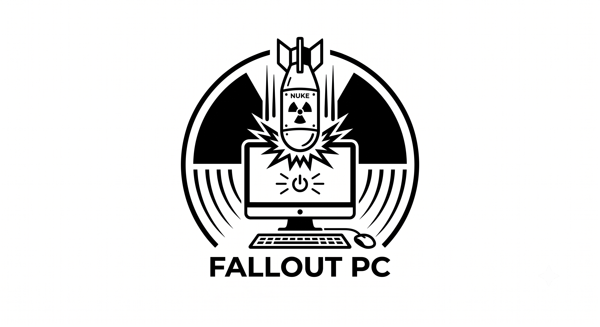

<p align="center">
  
</p>

<h1 align="center">FALLOUT PC</h1>

<p align="center">
  Detona cache de ferramentas de dev e temporários do sistema pra liberar espaço em disco.<br>
  Windows, macOS e Linux — sem mexer em login, senha ou token de nada.
</p>

---

## O que é

Um script (`nuke.sh`) que limpa cache de ferramentas de desenvolvimento —
pip, uv, npm, yarn, pnpm, deno, bun, go, cargo/rust, PHP/Composer,
Java (Maven/Gradle), ccache, sccache, vcpkg, MSYS2, Visual Studio/NuGet,
git, GitHub CLI, Hugging Face, Ollama — além de containers, imagens e
build cache do Docker, e arquivos temporários do sistema.

A ideia é simples: depois de meses de uso, essas ferramentas acumulam
gigabytes de cache que ninguém olha de novo. O script libera esse espaço,
com um preview de tudo antes de apagar qualquer coisa de verdade.

## Regra inegociável

O script **nunca** mexe em login, senha ou token de nada: credenciais do
git, chaves SSH, login do `gh` CLI, token do Hugging Face, chave de
identidade do Ollama, login do Docker, `~/.npmrc`,
`~/.cargo/credentials.toml`, `~/.m2/settings.xml`. Só cache e build
artifact — coisa que se reconstrói sozinha.

## Como usar

Todos os arquivos pra rodar estão em [`nuke/`](nuke/).

**Windows** → clique duas vezes em [`nuke/nuke.bat`](nuke/nuke.bat)
(precisa de Git Bash ou WSL instalado; se não tiver, o próprio script
avisa e indica como instalar)

**macOS** → clique duas vezes em [`nuke/nuke.command`](nuke/nuke.command)
(funciona direto, sem instalar nada a mais)

**Linux** → rode `chmod +x nuke.sh && ./nuke.sh` dentro da pasta `nuke/`

Ao rodar, o script:
1. Pergunta se você quer ver antes o que seria feito (`--dry-run`) — não
   apaga nada nessa etapa, só mostra.
2. Depois pergunta se quer rodar de verdade.
3. No final mostra quanto espaço foi liberado.

Se aparecer aviso sobre volumes do Docker, preste atenção: isso apaga
dado de verdade (não é só cache), então só confirme se tiver certeza.

### Uso avançado (terminal)

```
./nuke.sh --dry-run                    # só mostra, não apaga nada
./nuke.sh --only pip,npm,go,cargo      # limpa só o que quiser
./nuke.sh --yes                        # não pergunta nada
./nuke.sh --skip-docker-volumes        # pula a limpeza de volumes docker
./nuke.sh --help                       # lista todas as opções
```

### Limpando ambientes virtuais de projetos (opcional)

Além do cache global de cada ferramenta, o script também pode procurar e
apagar pastas de ambiente/dependências (`.venv`, `venv`, `node_modules`,
`vendor`, `target`, `build`, `.gradle`) dentro de projetos seus — sem tocar
em `.git` nem no resto do código.

Pra ativar, edite [`nuke/config.json`](nuke/config.json) e liste as pastas
onde seus projetos ficam (caminho absoluto, um por linha, aceita espaço no
nome; use barra normal `/` mesmo no Windows):

```json
{
  "scan_dirs": [
    "C:/Users/seu-nome/Projetos",
    "/home/seu-nome/dev"
  ]
}
```

Com isso configurado, `./nuke.sh` já inclui esse alvo automaticamente (ou
rode só ele com `./nuke.sh --only projects`). Lista vazia = desativado.

## Estrutura do repositório

```
nuke/            script principal + lançadores por sistema operacional
nuke/config.json onde você lista as pastas de projetos (ambientes virtuais)
imgs/            identidade visual do projeto
CLAUDE.md        contexto e convenções de desenvolvimento do projeto
LICENSE          licença MIT
```

## Sobre o desenvolvimento

Este projeto nasceu de uma necessidade bem direta: eu só queria conseguir
limpar os arquivos temporários e caches acumulados no meu computador, sem
precisar decorar comando por comando de cada ferramenta.

Foi desenvolvido com **desenvolvimento assistido por IA**, usando o
[Claude Code](https://claude.com/claude-code) — com revisão e testes reais
a cada etapa (incluindo validação numa máquina Windows de verdade, cobrindo
Git Bash e WSL), não apenas aceitando o que a IA gerava sem checar.

## Licença

[MIT](LICENSE) — uso livre, sem garantias.
